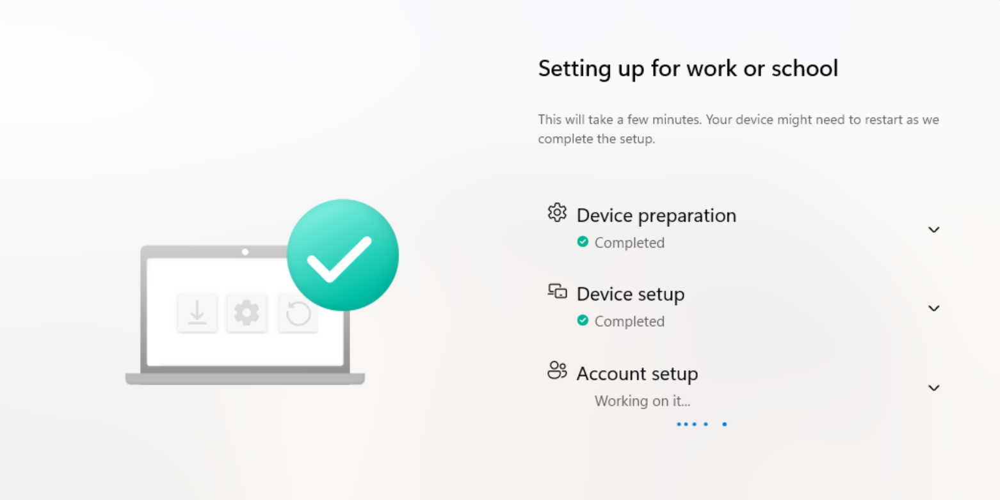

# MyLogiGroup - Modern Workplace & Endpoint Engineering Lab

An end-to-end **Microsoft Modern Workplace** lab built from bare metal to cloud, demonstrating hybrid identity, Zero-Trust Conditional Access, Windows Autopilot, Intune endpoint management, security baselines, and enterprise application packaging.

Built and operated under a fictional company, **MyLogiGroup** (`corp.mylogigroup.online` on-prem AD / `MyLogiGroup.onmicrosoft.com` cloud tenant), on a self-hosted **Proxmox** virtualisation host with **pfSense**-segmented VLAN networking.

> **Why this lab exists:** to demonstrate the exact stack used by Modern Workplace / End-User-Computing engineering teams - Microsoft Entra ID, Intune, Windows 365/Autopilot, Conditional Access, and application deployment with real, screenshot-backed proof rather than tutorial theory.

---



## Architecture at a glance

```
Proxmox Virtualisation Environment
  ├─ pfSense ........ firewall / router / DHCP - VLAN10 LAN, VLAN20 MGMT, VLAN30 DMZ
  ├─ DC01 ........... Windows Server 2025 - Active Directory + DNS (corp.mylogigroup.online)
  ├─ SRV01 .......... Windows Server 2022 - Entra Connect Sync + app packaging
  └─ CLIENT01 .... Windows 11 Enterprise - Autopilot/Intune managed endpoints
                              │
                              ▼
        Microsoft 365 E3 tenant (MyLogiGroup.onmicrosoft.com)
        Entra ID P1 · Intune · Conditional Access · Defender
```

**On-prem network:** VLAN10 `10.0.10.0/24` (servers + clients) · VLAN20 `10.0.20.0/24` (management) · VLAN30 `10.0.30.0/24` (DMZ), trunked from pfSense over a VLAN-aware Proxmox bridge.

---

## Projects

| # | Project | Skills demonstrated | Status |
|---|---------|--------------------|--------|
| 0 | [Foundation - Tenant, Licensing & Groups](portfolio/00-foundation/README.md) | M365 E3, Entra ID P1, custom domain, dynamic device groups | ✅ Complete |
| 1 | [Hybrid Identity - Entra Connect](portfolio/01-hybrid-identity/README.md) | Entra Connect Sync, password hash sync, Hybrid Entra Join | ✅ Complete |
| 2 | [Conditional Access Baseline](portfolio/02-conditional-access/README.md) | Zero Trust, MFA, legacy-auth block, break-glass, device compliance | ✅ Complete |
| 3 | [Intune Enrollment + Autopilot](portfolio/03-intune-autopilot/README.md) | Windows Autopilot (user-driven), Intune MDM, ESP, compliance | ✅ Complete |
| 4 | [Windows 11 SOE + Security Baselines](portfolio/04-windows11-soe/README.md) | Security baselines, BitLocker + Entra key escrow, Defender, hardening | 🔜 In progress |
| 5 | [Application Packaging (PSADT + Win32)](portfolio/05-app-packaging/README.md) | PSADT, `.intunewin`, detection rules, deployment rings, MSI/EXE/PowerShell | ✅ Complete |

---


## Tooling & technologies

**Identity & Cloud:** Microsoft Entra ID (P1), Entra Connect Sync, Conditional Access, Microsoft 365 E3
**Endpoint Management:** Microsoft Intune, Windows Autopilot, Enrollment Status Page, device compliance
**Application Deployment:** PowerShell App Deployment Toolkit (PSADT), Win32 Content Prep Tool, detection rules
**Security:** Security baselines, BitLocker, Microsoft Defender, MFA, Zero Trust
**Infrastructure:** Proxmox VE, pfSense, VLAN segmentation, Windows Server 2022/2025, Active Directory, DNS
**Scripting:** PowerShell

---

## Real-world troubleshooting (the part that matters)

This lab wasn't frictionless, and that's the point. Documented and solved issues include:

- **DNS suffix poisoning** - pfSense DHCP was stamping a bad domain suffix onto clients, mangling Microsoft endpoint resolution and blocking Autopilot; corrected the DHCP domain-name field.
- **Cloud Sync vs Entra Connect Sync** - identified that Cloud Sync cannot perform Hybrid Entra Join, and migrated to full Entra Connect Sync.
- **SMBIOS serial collision** - Autopilot device registered with a placeholder serial (`SMBIOS_STRING_INDEX_0`); set a real SMBIOS serial in Proxmox and re-registered.
- **App packaging detection mismatch** - a deployment failed because an MSI detection rule was applied to an EXE-packaged app; corrected by repackaging with the vendor MSI and the real product code.

Each project is documented in its relevant project folder.

---

* Author: Nishan Rajmulik · [LinkedIn](https://linkedin.com/in/nrajmulik) · [GitHub](https://github.com/nishanrajmulik1)
