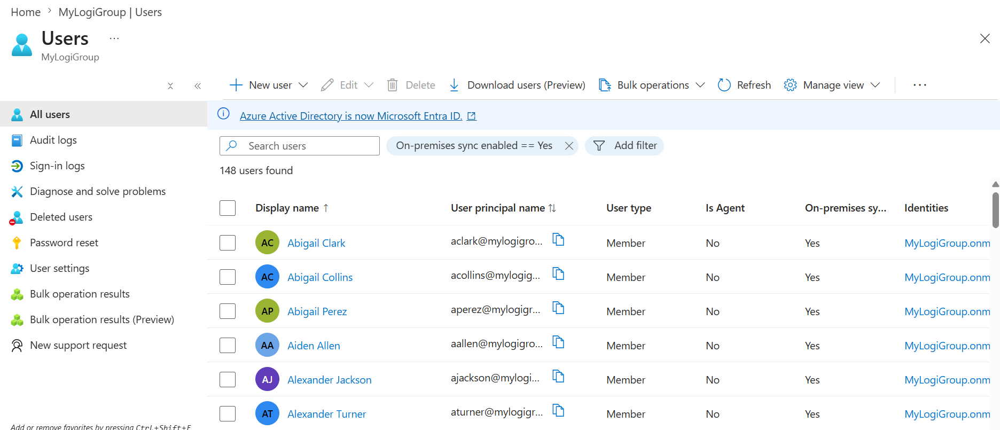
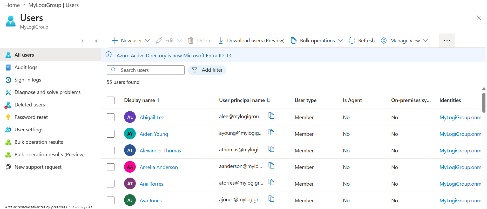
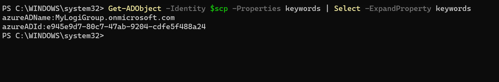
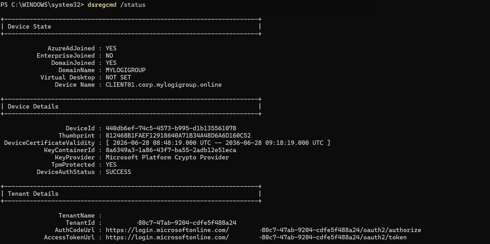

# Project 1 Hybrid Identity with Microsoft Entra Connect

**Goal:** Synchronise on-prem Active Directory to Microsoft Entra ID and enable **Hybrid Entra Join**, so domain-joined Windows devices register automatically with the cloud tenant.

**Maps to JD:** Microsoft Entra ID & Identity Integration.

## What was built
- **Microsoft Entra Connect Sync** installed on SRV01 (a domain member server, not the DC, per best practice).
- **Password Hash Sync** enabled; on-prem AD users (`corp.mylogigroup.online`) synced to Entra ID.
- **Routable UPN suffix** added in AD so users sign in with a verified domain rather than a non-routable `.local` suffix.
- **Hybrid Entra Join** configured Entra Connect wrote the **Service Connection Point (SCP)** to AD, allowing domain-joined devices to register with Entra automatically.

## Key decision: Entra Connect Sync vs Cloud Sync
Cloud Sync is Microsoft's lightweight provisioning agent, but it **cannot configure Hybrid Entra Join**. Because this project requires a hybrid join, the full **Entra Connect Sync** was used. Being able to explain *why* one was chosen over the other is a practical, field-relevant distinction.

## Proof
| Evidence | File |
|----------|------|
| On-prem users synced to Entra ID | |
| Synced users visible in Entra (On-premises sync - Yes) | |
| Hybrid Entra Join configured | |
| Device hybrid/Entra-joined (`dsregcmd /status`: AzureAdJoined YES, TpmProtected YES, DeviceAuthStatus SUCCESS) | |

## Troubleshooting documented
- **Kerberos `0x31 Invalid Credentials`** during the Entra Connect LDAP bind root cause was ~24h **VM clock skew** between SRV01 and DC01 (Kerberos tolerates ≤5 min). Fixed the domain time hierarchy and anchored the PDC emulator to an external NTP server.
- Verified the SCP via `Get-ADObject` against the `Device Registration Configuration` container, confirming `azureADName` and `azureADId` keywords.

## Skills
Entra Connect Sync · password hash sync · Hybrid Entra Join · SCP · routable UPN suffix · Kerberos/time-sync troubleshooting
